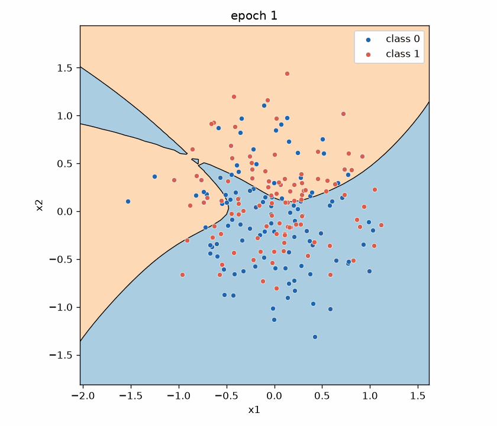

# micrograd-project

A from-scratch scalar autograd engine and tiny neural network, trained on an interleaved-spirals dataset to learn a nonlinear decision boundary - inspired by [Karpathy's micrograd](https://github.com/karpathy/micrograd). Every forward pass, backward pass, and weight update runs through hand-rolled `Value` objects with no PyTorch or NumPy math inside the model itself.



## What I built from scratch

- **`engine.py`** — `Value` class with operator overloading (`+`, `-`, `*`, `/`, `**`, `tanh`), computation-graph tracking, and reverse-mode `.backward()` via topological sort and the chain rule
- **`nn.py`** — `Neuron`, `Layer`, and `MLP` built entirely from `Value` objects (weights, biases, and all computations)
- **`train.py`** — SGD training loop with MSE loss, gradient zeroing, and per-epoch logging
- **`visualize.py`** — decision-boundary contour plot and optional training GIF snapshots
- **`tests/test_engine.py`** — pytest checks that `Value` gradients match PyTorch on several expressions

NumPy and matplotlib are used only for dataset generation and plotting; PyTorch appears only as a reference in tests.

## How to run

```bash
python -m venv venv
source venv/bin/activate
pip install numpy matplotlib torch pytest pillow

# Run gradient tests (Value vs PyTorch)
pytest tests/test_engine.py -v

# Train the MLP on spirals (~2–3 min)
python train.py

# Plot the final decision boundary → decision_boundary.png
python visualize.py

# Train with snapshots and build the demo GIF → training.gif
python visualize.py --animate --epochs 400 --snapshot-every 20
```
